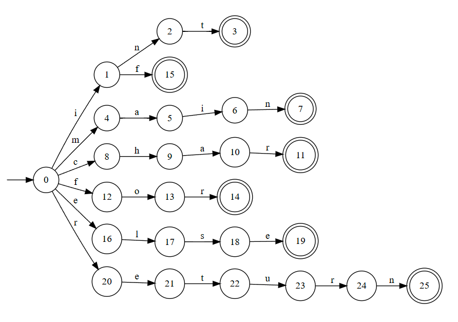
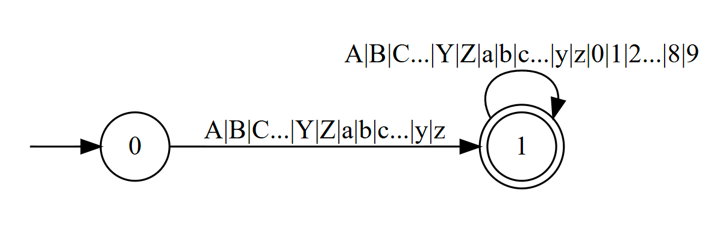
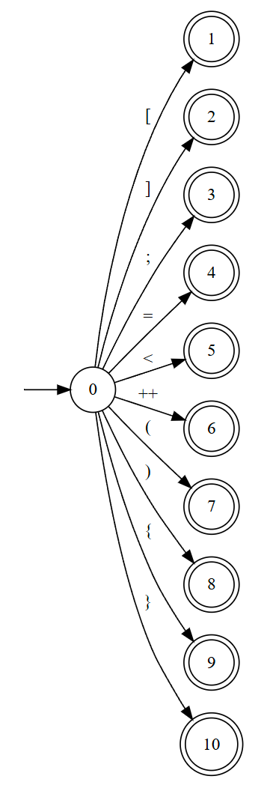
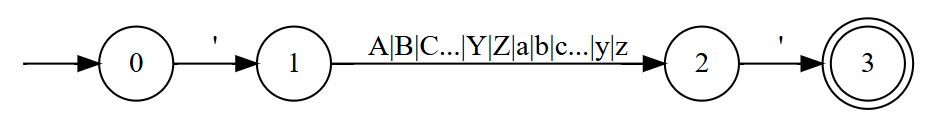
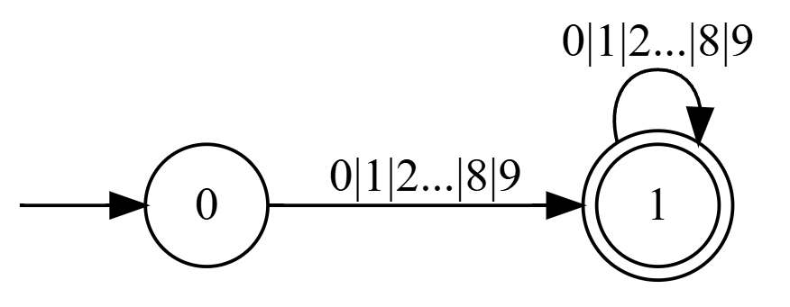
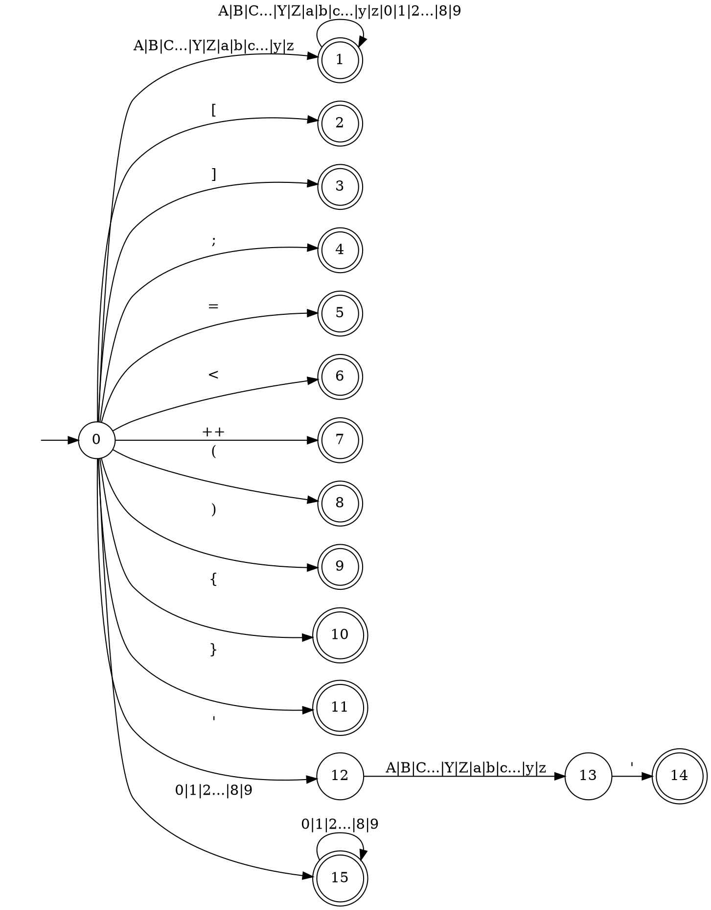
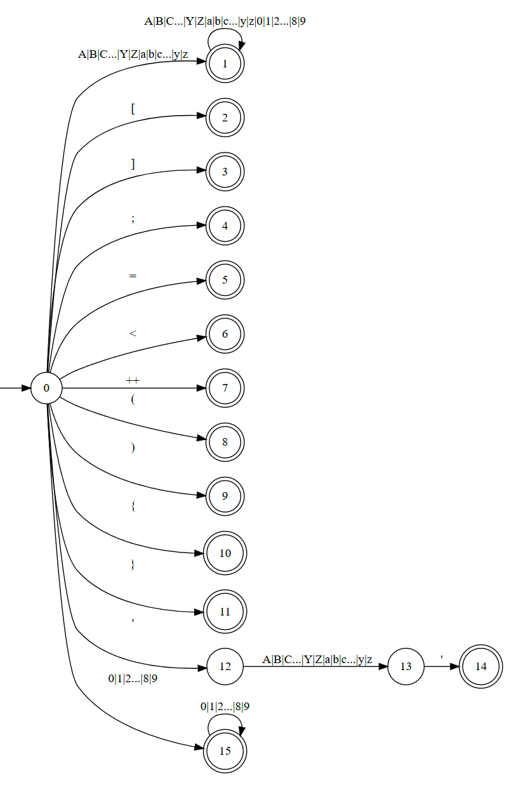

# **LEX&ensp;实验报告**&ensp;(57122432王宇鹏)
### &ensp;&ensp;&ensp;*Date：2024-11-05*
### 1.&ensp;预期目标
---
#### *将下面代码构成的&ensp;txt&ensp;文件转化为&ensp;token&ensp;序列*
```cpp
    int main()
    {
        char ch[100];
        int i;
        for (i=0;i<100;++i)
        {
            if (i < 50)
                ch[i]='a';
            else
                ch[i]='b';
        }
        return 0;
    }
```
### 2.&ensp;整体设计
---
* lex由c++编写
* 分为三部分设计  
&emsp;  1.文件&ensp;I&ensp;O  
&emsp;  2.词法定义  
&emsp;  3.词法分析  
* 成员函数封装在&ensp;lex &ensp;c++类中
### 3.&ensp;需求分析
---
#### *1.需要定义如下的词法*
* 保留字：int&ensp;**|**&ensp;main&ensp;**|**&ensp;char&ensp;**|**&ensp;for&ensp;**|**&ensp;if&ensp;**|**&ensp;else&ensp;**|**&ensp;return
* 标识符：A **|** B **|** C...Y **|** Z **|** a **|** b **|** c... **|** y **|** z&ensp;**+**&ensp; **(** A **|** B **|** C...Y **|** Z **|** a **|** b **|** c... **|** y **|** z **|** 0 **|** 1 **|** 2... **|** 8 **|** 9 **)** *
* 操作符：[ &ensp;**|**&ensp; ]&ensp; **|** &ensp;;&ensp;**|**&ensp;=&ensp;**|**&ensp;<&ensp;**|**&ensp;++&ensp;**|**&ensp;(&ensp;**|**&ensp;)&ensp;**|**&ensp;{&ensp;**|**&ensp;}
* &emsp;字符：' **+** A **|** B **|** C...Y **|** Z **|** a **|** b **|** c... **|** y **|** z **+** '
* &emsp;整数：**(** 0 **|** 1 **|** 2... **|** 8 **|** 9 **)**+   
<br />  
<br />

#### *2.其他要考虑的问题*
* 空格
* 换行
### 4.&ensp;自动机构造
---
#### *使用&ensp;graphviz&ensp;online&ensp;工具绘制*
#### 1.保留字
---
* 保留字使用固定的保留字典定义
* 保留字非最简DFA如下(未使用) 

#### 2.标识符
---

#### 3.操作符
---

#### 4.字符
---

#### 5.整数
---

### 5.&ensp;自动机合成
---
#### *1.dot绘图网址代码如下*
*<https://dreampuf.github.io/GraphvizOnline>*
---

#### *2.合成后的最简&ensp;DFA&ensp;如下*
---

<br />
<br />
<br />
<br />
<br />
<br />

### 6.&ensp;代码实现
---
#### 1.lex.h
```cpp
    #pragma once
    #include <fstream>
    #include <iostream>
    #include <string>
    using namespace std;
    class lex
    {
    public:
        lex();
        ~lex();
        int ReadFile(const string& file_path);
        void PrintContent();
        void Analysis();
        void WriteResult(const string& file_path);
    private:
        bool IsDigit(const char& ch);
        bool IsLetter(const char& ch);
        int IsKeyword(const string& wd);
        string content_;
        string result_;
    };
```
<br />
<br />
<br />
<br />
<br />
<br />
<br />
<br />
<br />
<br />
<br />
<br />
<br />
<br />
<br />
<br />
<br />
<br />
<br />
<br />

#### 2.lex.cpp
```cpp
    #include "lex.h"
    lex::lex(){}
    lex::~lex(){}
    bool lex::IsDigit(const char& ch)
    {
        return (ch >= '0' && ch <= '9');
    }
    bool lex::IsLetter(const char& ch)
    {
        return (ch >= 'A' && ch <= 'Z') || (ch >= 'a' && ch <= 'z');
    }
    int lex::IsKeyword(const string& wd)
    {
        if (wd == "int" || wd == "main" || wd == "char" || wd == 
        "for" || wd == "if" || wd == "else" || wd =="return") {
            this->result_ += "<保留字 ";
            this->result_ += wd;
            this->result_ += " 0>\n";
            return 1;
        }
        else {
            return 0;
        }
    }
    int lex::ReadFile(const string& file_path)
    {
        ifstream file;

        file.open(file_path, ios::in);
        if (!file.is_open())
        {
            cout << "\nFailed to open the file!" << endl;
            return -1;
        }
        while (!file.eof())
        {
            string line;
            getline(file, line);
            this->content_ += line + "\n";
        }
        file.close();
        return 0;
    }
    void lex::PrintContent()
    {
        cout << "\nContent of the file:\n\n"
            << "----------------------------------------\n\n"
            << this->content_ << "--------------------
            --------------------\n\n";
    }
    void lex::Analysis()
    {
        int index = 0;
        char ch = this->content_[0];
        while (this->content_[index])
        {
            if (IsLetter(ch)) {
                string temp = "";
                while (IsDigit(ch)|| IsLetter(ch)) {
                    temp += ch;
                    ch = this->content_[++index];
                }
                if (!IsKeyword(temp)) {
                    this->result_ += "<标识符 ";
                    this->result_ += temp;
                    this->result_ += " 1>\n";
                }
            }
            if (ch == '[') {
                this->result_ += "<操作符 [ 2>\n";
                ch = this->content_[++index];
            }
            if (ch == ']') {
                this->result_ += "<操作符 ] 3 >\n";
                ch = this->content_[++index];
            }
            if (ch == ';') {
                this->result_ += "<操作符 ; 4 >\n";
                ch = this->content_[++index];
            }
            if (ch == '=') {
                this->result_ += "<操作符 = 5>\n";
                ch = this->content_[++index];
            }
            if (ch == '<') {
                this->result_ += "<操作符 < 6>\n";
                ch = this->content_[++index];
            }
            if (ch == '++') {
                this->result_ += "<操作符 ++ 7>\n";
                ch = this->content_[++index];
            }
            if (ch == '(') {
                this->result_ += "<操作符 ( 8>\n";
                ch = this->content_[++index];
            }
            if (ch == ')') {
                this->result_ += "<操作符 ) 9>\n";
                ch = this->content_[++index];
            }
            if (ch == '{') {
                this->result_ += "<操作符 { 10>\n";
                ch = this->content_[++index];
            }
            if (ch == '}') {
                this->result_ += "<操作符 } 11>\n";
                ch = this->content_[++index];
            }
            if (ch == '\'') {
                ch = this->content_[++index];
                if (IsLetter(ch)) {
                    this->result_ += "<字符 ";
                    this->result_ += ch;
                    this->result_ += " 14>\n";
                }
                ch = this->content_[++index];
                ch = this->content_[++index];
            }
            if (IsDigit(ch)) {
                this->result_ += "<整数 ";
                while (IsDigit(ch)) {
                    this->result_ += ch;
                    ch = this->content_[++index];
                }
                this->result_ += " 15>\n";
            }
            else {
                ch = this->content_[++index];
            }
        }
    }

    void lex::WriteResult(const string& file_path)
    {
        ofstream file;
        string result_file_path =
            file_path.substr(0, file_path.length() - 4) + "_result.txt";
        file.open(result_file_path, ios::out);
        if (!file.is_open())
        {
            cout << "\nFailed to open the file!" << endl;
        }
        file << this->result_;
        file.close();
        cout << "\nResult has been written to \"" << result_file_path << "\"\n";
    }
```
<br />
<br />
<br />
<br />
<br />
<br />
<br />
<br />
<br />
<br />
<br />
<br />
<br />
<br />

#### 3.main.cpp
```cpp
    #include "lex.h"
    int main()
    {
        lex lex;
        string file_path;
        /***** 读入文件 *****/
        while (true)
        {
            cout << "Please enter the file path: ";
            getline(cin, file_path);
            if (!lex.ReadFile(file_path)) break;
        }
        /***** 打印文件 *****/
        lex.PrintContent();
        /***** 词法分析 *****/
        lex.Analysis();
        /***** 写出序列 *****/
        lex.WriteResult(file_path);
        system("pause");
        return 0;
    }
```
<br />
<br />
<br />
<br />
<br />
<br />
<br />
<br />
<br />
<br />
<br />
<br />
<br />
<br />
<br />
<br />
<br />
<br />
<br />
<br />
<br />
<br />
<br />
<br />
<br />

### 7.&ensp;实验结果
---
#### *词法分析后token序列存储在txt文本文件中内容如下*
```txt
    <保留字 int 0>
    <保留字 main 0>
    <操作符 ( 8>
    <操作符 ) 9>
    <操作符 { 10>
    <保留字 char 0>
    <标识符 ch 1>
    <操作符 [ 2>
    <整数 100 15>
    <操作符 ] 3 >
    <操作符 ; 4 >
    <保留字 int 0>
    <标识符 i 1>
    <操作符 ; 4 >
    <保留字 for 0>
    <操作符 ( 8>
    <操作符 = 5>
    <整数 0 15>
    <操作符 ; 4 >
    <操作符 < 6>
    <整数 100 15>
    <操作符 ; 4 >
    <标识符 i 1>
    <操作符 ) 9>
    <操作符 { 10>
    <保留字 if 0>
    <操作符 ( 8>
    <操作符 < 6>
    <整数 50 15>
    <操作符 ) 9>
    <标识符 ch 1>
    <操作符 [ 2>
    <操作符 ] 3 >
    <操作符 = 5>
    <字符 a 14>
    <保留字 else 0>
    <标识符 ch 1>
    <操作符 [ 2>
    <操作符 ] 3 >
    <操作符 = 5>
    <字符 b 14>
    <操作符 } 11>
    <保留字 return 0>
    <整数 0 15>
    <操作符 ; 4 >
    <操作符 } 11>   
```